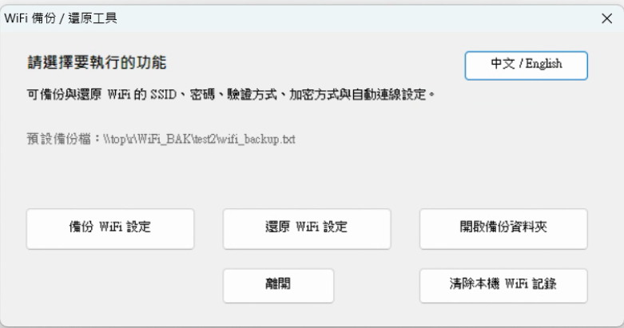
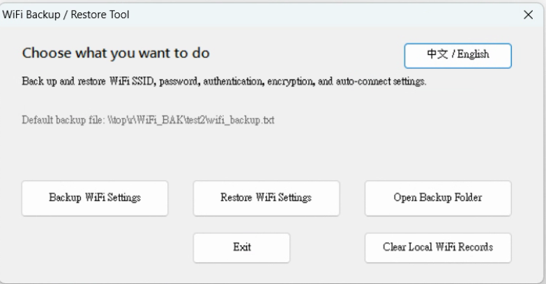
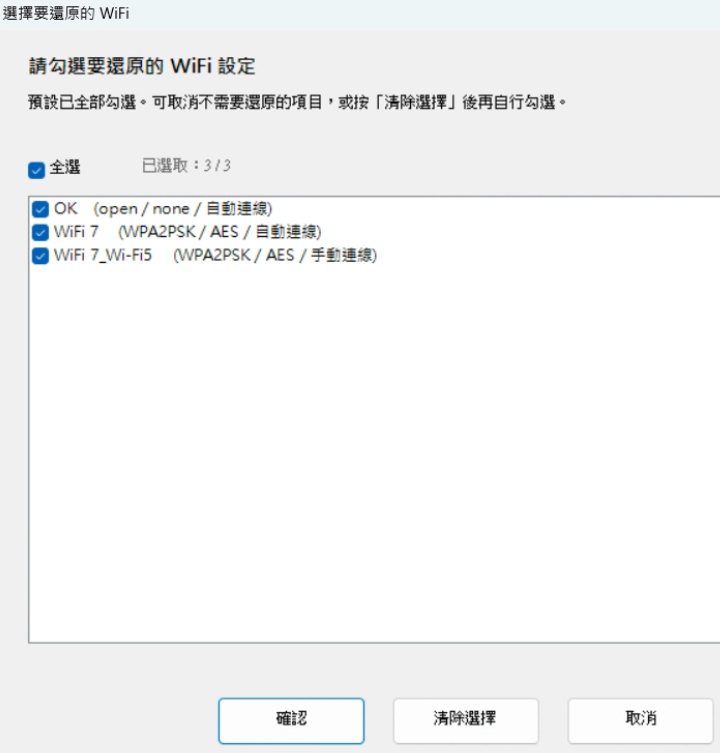
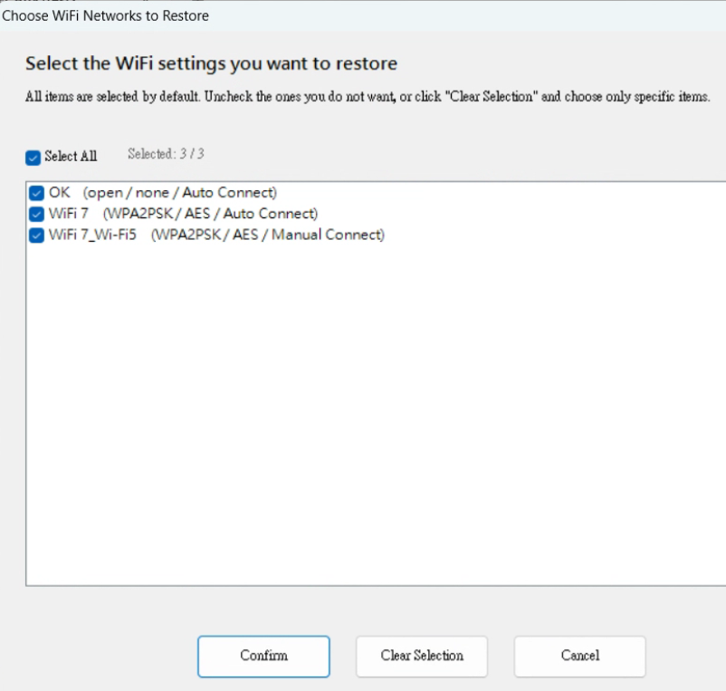
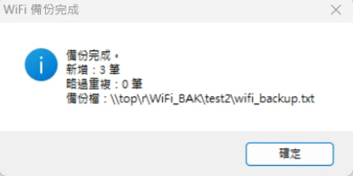
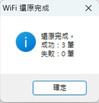
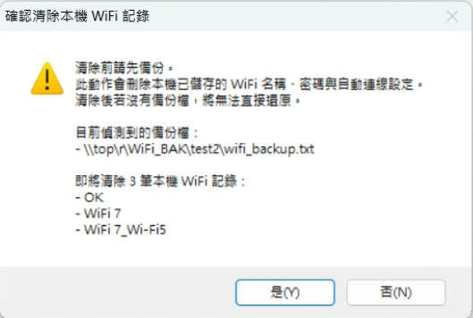
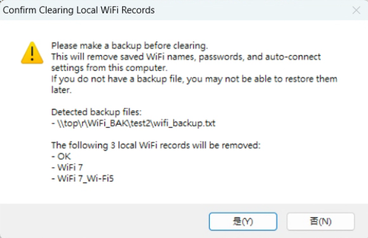
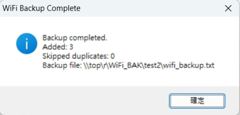
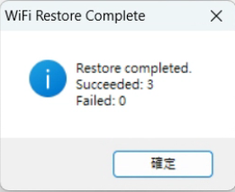

# 📶 Windows WiFi Backup Restore

**[🇺🇸 English](#-english-introduction) | [🇹🇼 繁體中文](#-繁體中文介紹)**

---

## 🇹🇼 繁體中文介紹

**Windows WiFi Backup Restore** 是一個用於備份與還原 Windows WiFi 設定的可攜式工具，適合 **IT 管理員**、**現場維護人員**，以及需要在多台電腦之間快速搬移 WiFi 設定的使用者。

它可以備份 SSID、密碼、驗證方式、加密方式與自動連線設定，並支援從備份檔中勾選要還原的 WiFi、清除本機 WiFi 記錄，以及依照系統語言自動切換中英文介面。

### ✨ 主要功能

- **備份 WiFi 設定**：匯出已儲存的 SSID、密碼、驗證方式、加密方式與自動連線設定。
- **還原指定 WiFi**：可從備份檔清單中勾選部分或全部 WiFi 進行還原。
- **避免重複寫入**：若備份檔中已存在相同 SSID，會自動略過重複項目。
- **支援舊版備份檔**：可讀取 `wifi_backup.txt` 與舊版 `wifi_profiles_backup.txt`。
- **清除本機 WiFi 記錄**：可先檢查備份檔，再清除本機已儲存的 WiFi 記錄。
- **中英文雙語介面**：依系統語言自動顯示繁中或英文，也可手動切換。
- **單一簽名 EXE**：免安裝，直接執行即可使用。

### 🖼️ 介面預覽

#### 主畫面

| 繁體中文 | English |
| --- | --- |
|  |  |

#### 還原選擇視窗

| 繁體中文 | English |
| --- | --- |
|  |  |

#### 備份與還原完成提示

| 備份完成 | 還原完成 |
| --- | --- |
|  |  |

#### 清除本機 WiFi 記錄警告

| 繁體中文 | English |
| --- | --- |
|  |  |

### 🚀 使用方式

#### 備份

1. 以 **系統管理員身分** 執行工具。
2. 選擇 `備份 WiFi 設定`。
3. 工具會掃描本機已儲存的 WiFi 並匯出到備份檔。
4. 若備份檔已存在，會保留舊資料並自動略過重複 SSID。

#### 還原

1. 以 **系統管理員身分** 執行工具。
2. 確認 `wifi_backup.txt` 或 `wifi_profiles_backup.txt` 放在工具同一資料夾。
3. 選擇 `還原 WiFi 設定`。
4. 在清單中勾選要還原的 WiFi，按下 `確認` 開始還原。

#### 清除本機 WiFi 記錄

1. 點選 `清除本機 WiFi 記錄`。
2. 確認警告視窗中的備份提示與即將刪除的 WiFi 清單。
3. 按下 `是` 後，工具會逐筆清除本機已儲存的 WiFi 記錄。

### 📦 下載

目前版本：`v1.0.0.0`

上方下載數量徽章會以 GitHub Releases 正式發行檔為準；目前可先從下方下載資料夾直接取得簽名 EXE。

- [前往 Releases / 發行版本頁面](https://github.com/Terence0816/Windows-WiFi-Backup-Restore/releases)
- [開啟下載資料夾](https://github.com/Terence0816/Windows-WiFi-Backup-Restore/tree/main/downloads)
- [直接下載 WiFiBackupRestore_v1.0.0.0_signed.exe](https://github.com/Terence0816/Windows-WiFi-Backup-Restore/raw/main/downloads/WiFiBackupRestore_v1.0.0.0_signed.exe)

### 🔎 搜尋關鍵字

以下關鍵字有助於在 GitHub 或搜尋引擎中較容易找到這個工具：

`wifi backup`, `wifi restore`, `wifi profile backup`, `ssid password backup`, `windows wifi tool`, `wlan backup`, `wireless migration`, `portable network utility`

### ⚠️ 注意事項

- 必須以系統管理員權限執行。
- 企業型 WiFi（802.1X）通常無法完整匯出帳號與密碼，還原後可能仍需手動輸入。
- 還原結果仍可能受到 Windows 版本、無線網卡驅動與無線服務狀態影響。
- 若目標電腦沒有可用的無線網卡或 WLAN AutoConfig 服務異常，可能無法正常還原或套用設定。

### 📄 授權

MIT License

---

## 🇺🇸 English Introduction

**Windows WiFi Backup Restore** is a portable utility for backing up and restoring saved WiFi settings on Windows. It is designed for **IT administrators**, **support engineers**, and users who need to move WiFi profiles between multiple Windows computers.

It can back up SSID, password, authentication, encryption, and auto-connect settings, then let you restore all or only selected WiFi profiles from a backup file. It also supports clearing local WiFi records and automatically switching the interface between Traditional Chinese and English.

### ✨ Key Features

- **Back up WiFi settings**: Export saved SSID, password, authentication, encryption, and auto-connect settings.
- **Restore selected WiFi profiles**: Choose some or all WiFi entries from the backup list before restoring.
- **Skip duplicate SSIDs**: Existing backup entries are preserved and duplicate WiFi names are skipped automatically.
- **Legacy backup compatibility**: Supports both `wifi_backup.txt` and older `wifi_profiles_backup.txt`.
- **Clear local WiFi records**: Review a warning dialog before removing saved WiFi profiles from the current PC.
- **Bilingual interface**: Automatically uses Traditional Chinese or English based on the system language, with manual switching available.
- **Single signed EXE**: Portable and ready to run without installation.

### 🖼️ Interface Preview

#### Main Menu

| Traditional Chinese | English |
| --- | --- |
|  |  |

#### Restore Selection Window

| Traditional Chinese | English |
| --- | --- |
|  |  |

#### Backup and Restore Result Dialogs

| Backup Result | Restore Result |
| --- | --- |
|  |  |

#### Clear Local WiFi Warning

| Traditional Chinese | English |
| --- | --- |
|  |  |

### 🚀 Usage

#### Backup

1. Run the tool as **Administrator**.
2. Choose `Backup WiFi Settings`.
3. The tool scans saved WiFi profiles and exports them to the backup file.
4. If the backup file already exists, existing entries are kept and duplicate SSIDs are skipped automatically.

#### Restore

1. Run the tool as **Administrator**.
2. Make sure `wifi_backup.txt` or `wifi_profiles_backup.txt` is placed next to the tool.
3. Choose `Restore WiFi Settings`.
4. Select the WiFi profiles you want to restore, then click `Confirm`.

#### Clear Local WiFi Records

1. Click `Clear Local WiFi Records`.
2. Review the warning message and the list of WiFi profiles that will be removed.
3. Click `Yes` to delete the saved local WiFi records.

### 📦 Download

Current version: `v1.0.0.0`

The download badge at the top will reflect official GitHub Release assets. For now, you can download the signed EXE directly from the repository downloads folder below.

- [Open the Releases page](https://github.com/Terence0816/Windows-WiFi-Backup-Restore/releases)
- [Open the downloads folder](https://github.com/Terence0816/Windows-WiFi-Backup-Restore/tree/main/downloads)
- [Download WiFiBackupRestore_v1.0.0.0_signed.exe directly](https://github.com/Terence0816/Windows-WiFi-Backup-Restore/raw/main/downloads/WiFiBackupRestore_v1.0.0.0_signed.exe)

### 🔎 Search Keywords

These keywords can help more people find this project on GitHub and search engines:

`wifi backup`, `wifi restore`, `wifi profile backup`, `ssid password backup`, `windows wifi tool`, `wlan backup`, `wireless migration`, `portable network utility`

### ⚠️ Notes

- Administrator permission is required.
- Enterprise WiFi profiles using 802.1X usually cannot fully export account credentials, so manual input may still be needed after restore.
- Actual restore behavior may still depend on the Windows version, wireless adapter driver, and WLAN service status.
- If the target PC has no usable wireless adapter or the WLAN AutoConfig service is unavailable, restore may not complete successfully.

### 📄 License

MIT License
